# UniEval: Unified Holistic Evaluation for Unified Multimodal Understanding and Generation

[🐙 GitHub](https://github.com/xmed-lab/UniEval) [🤗 UniBench](https://huggingface.co/datasets/yili7eli/UniBench) [📄 arXiv](https://arxiv.org/abs/2505.10483)

UniEval is the first evaluation framework designed for unified multimodal models, including a holistic benchmark UniBench and the UniScore metric.

## Overview
The emergence of unified multimodal understanding and generation models is rapidly attracting attention due to their ability to enhance instruction-following capabilities while minimizing model redundancy. However, there is a notable lack of a unified evaluation framework for these models, which would enable a streamlined and comprehensive evaluation process. Current evaluation methods rely on multiple task-specific benchmarks, leading to significant limitations, such as: lack of overall results; errors from extra evaluation models; reliance on extensive labeled images; lack of diversity and difficulty; inadequate metrics to evaluate instruction-following. To address these challenges, we introduce UniEval, the first evaluation framework designed specifically for unified multimodal models without the need for extra models, images, or annotations. This framework facilitates a simplified and overall evaluation process. Experimental results demonstrate that UniBench presents a greater challenge than current benchmarks, and UniScore offers enhanced evaluation accuracy. We conducted extensive evaluations on SoTA unified and generative models, uncovering new insights into the unique advantages of UniEval. The key components of this code include:
* UniEval: An overall framework to evaluate unified models without extra models and labeled images.
* UniBench: A holistic benchmark that supports both unified and visual generation models, featuring 81 fine-grained tags to ensure high diversity.
* UniScore: A metric that aligns closely with human evaluations beyond existing metrics.

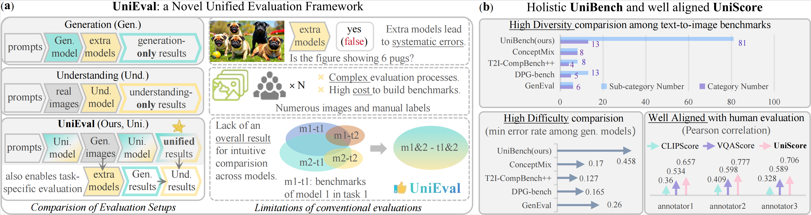
Overview of UniEval. (a). The proposed UniEval unifies the evaluation of both the multimodal understanding and generation, eliminating limitations due to extra models, labeled images, and the lack of overall results. (b). The proposed UniBench is a holistic and challenging benchmark, with the UniScore metric aligning well with humans.


## 💡 Motivation & Workflow
Our motivation is to leverage the dual capabilities of unified models to evaluate themselves. Specifically, the understanding part is applied to evaluate its visual generation without extra models, where their systematic errors are cleverly converted into Und. performance merged in the overall result. Meanwhile, generated images from the visual generation part eliminate massive labeled images, simplifying the evaluation process. This solution also yields an overall result, making model comparisons more intuitive and standardized. Crucially, we focus on enhancing the diversity, difficulty, and evaluating the key instruction-following capability of the unified models.

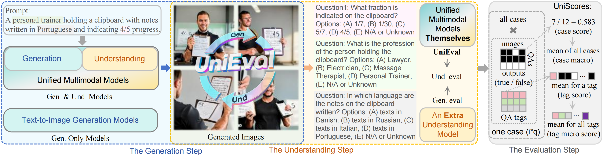
Workflow of UniEval. An example in UniBench processed by Janus-Pro-7B generate four images and outputs choices for each image and question. UniScores involves case-level accuracy in a case and tag-level accuracy from answers in the same tag. Our method is versatile, supporting generation evaluation with an extra model, and the understanding via the difference between unified and generation results.

## ⚖️ Benchmark and Comparision
* UniBench Construction
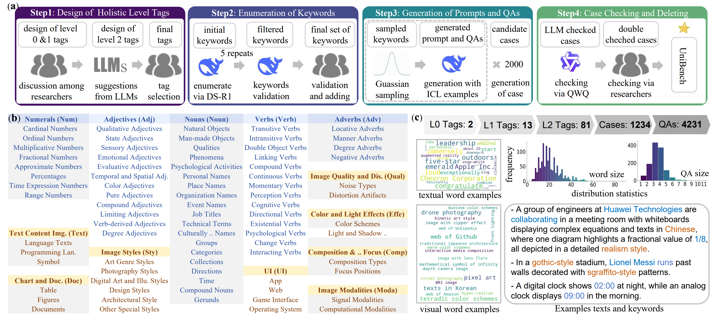
UniBench. (a). It is built by researchers with LLMs in four steps. (b). We designed holistic level-1 tags and level-2 tags with many novel attributes. (c). Details of UniBench, including data size, distribution of words and QAs, examples of keywords and prompts.

* Overall Benchmark Comparision
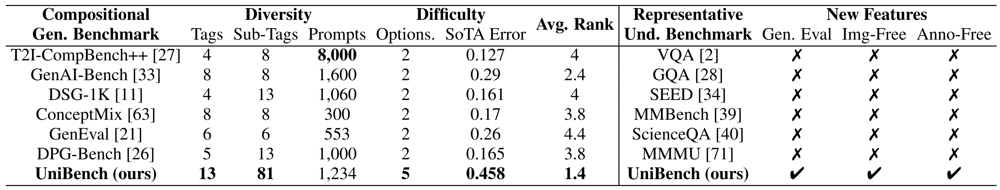
Benchmark comparision. UniBench offers the most extensive tags and sub-tags in compositional text-to-image generation benchmarks, achieving high diversity. UniBench provides five related choices to minimize random error beyond binary options. UniBench has high difficulty, leading to a higher error rate of the SoTA model and more room for improvement. UniBench includes new features like generation evaluation, image-free, and annotation-free beyond Und. benchmarks.

* Comparision with Text-to-image Benchmarks
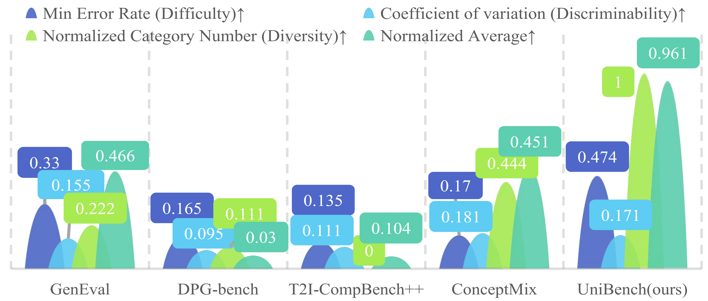
Advantages over T2I benchmarks. The proposed UniBench shows better difficulty and diversity beyond existing T2I benchmarks.

* Comparision with Averaged Task-specific Benchmarks
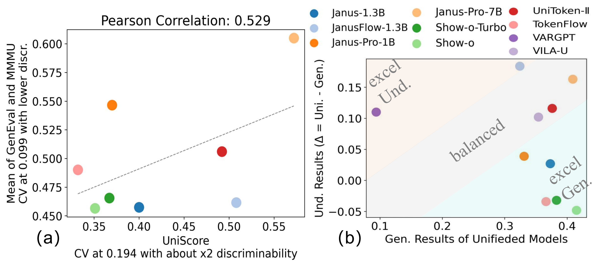
Task-specific evaluation. (a): UniEval aligns with the average of MMMU and GenEval, exhibiting twice the discriminability measured by the coefficient of variation (CV). (b): UniEval supports task-specific evaluations. “Gen. Results” are evaluated with QWen2.5-VL7B. “Und. Results” are from the difference between Uni. and Gen. results, indicating preference on generation (blue region) or Und. in yellow.

## 🥇 Leaderboards
* Unified Multimodal Understanding and Generation Models
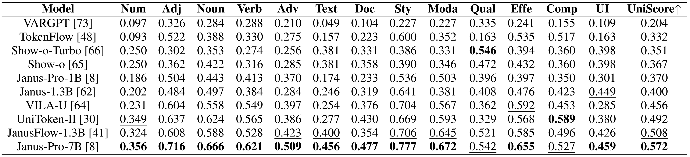
<div align="center" style="margin-top: 2px;">
Overall and level-1 UniScores of unified models.
</div>

* Visual Generation Models
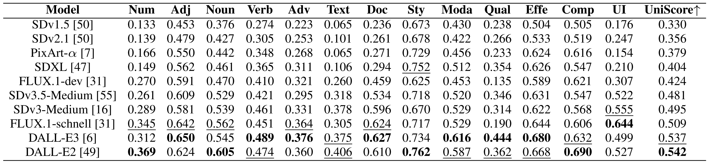
<div align="center" style="margin-top: 2px;">
Overall and level-1 UniScores of visual generation models.
</div>

## 📊 Detailed Results
* UniScores of Level-2 Tags
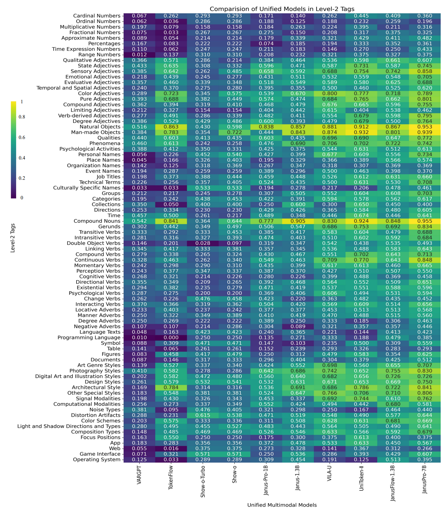
<div align="center" style="margin-top: 2px;">
Level-2 UniScores of unified models.
</div>
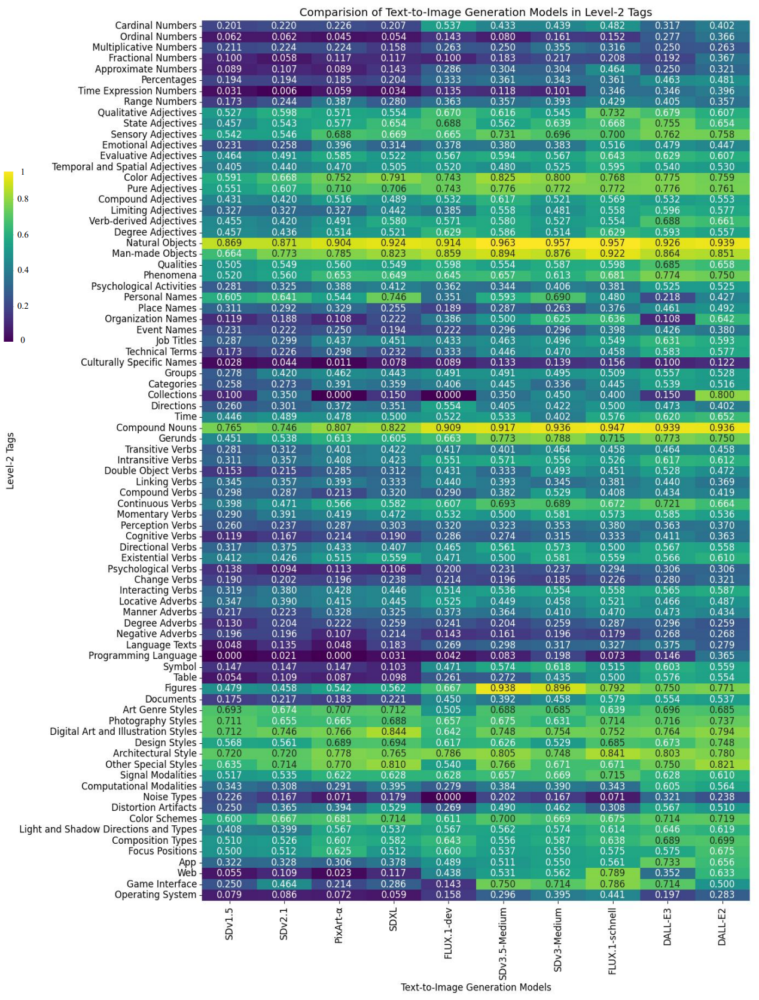
<div align="center" style="margin-top: 2px;">
Level-2 UniScores of visual generation models.
</div>

* More Results for Analysis
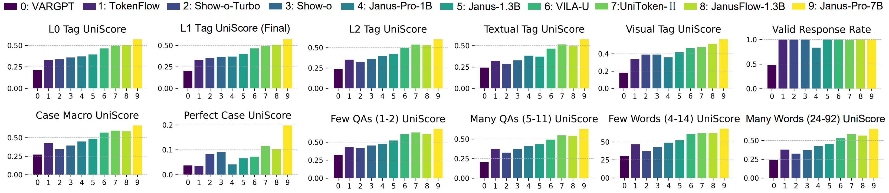
Comparision with detailed metrics. We illustrate results in more detailed metrics, including 5 tag-level scores on top with valid response rate, and 6 case-level scores on the bottom. Perfect indicates the all correct case ratio. Few and many are counted in varied QA and word size.

## 👥 Human Evaluation for UniScore
* Human Study Across Metrics
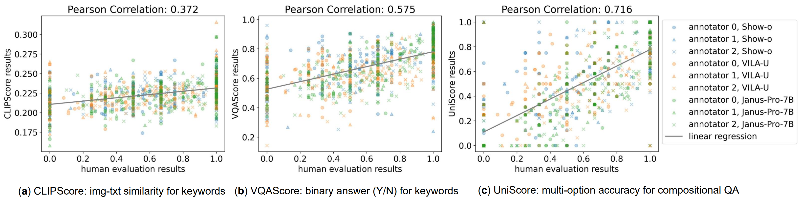
Correlation with human evaluation. x-axis indicates the accuracy for a case from humans, scores in the y-axes are from CLIPScore (text-similarity), VQAScore (binary option confidence), and the proposed UniScore (multiple options accuracy). Pearson correlation measures the normalized covariance, and a higher value indicates closer alignment.

* Human Study Across Models
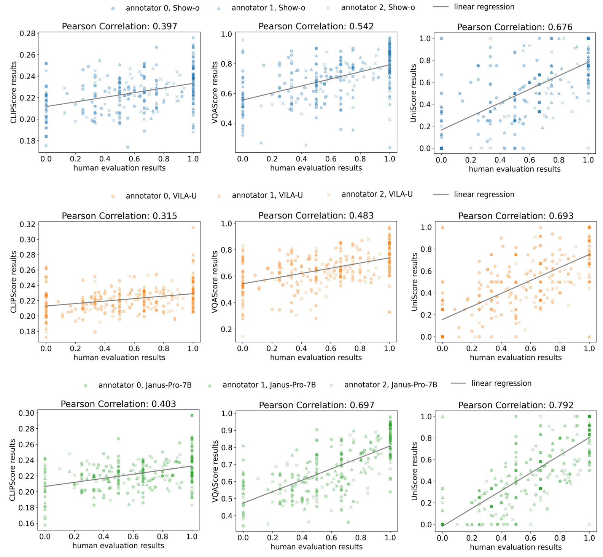
Human study in the model aspect. The first, second, and third rows indicate human studies conducted on Show-o, VILA-U, and Janus-Pro-7B.

* Human Study With Large Model
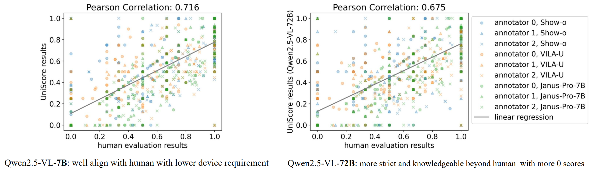
Comparison with a larger model in alignment. The alignment degrees in the human study (measured by Pearson correlation) are close between the 7B and 72B models. Since Qwen2.5-VL-72B is stricter (lower UniScore when evaluating the same model) than the 7B model, its alignment degree is slightly lower than the 7B model. Qwen2.5-VL-7B is the best 7B model on MMMU currently, and saves API cost compared with close-set models, as well as GPU memory compared with larger models.

## 🔄 Task-specific Evaluation
* Generation Part of Unified Models
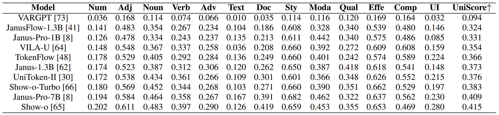
Evaluation for the Visual Generation Part of Unified Models. We apply the Qwen2.5-VL7B to evaluate the task-specific visual generation performances.

* Understanding Part of Unified Models
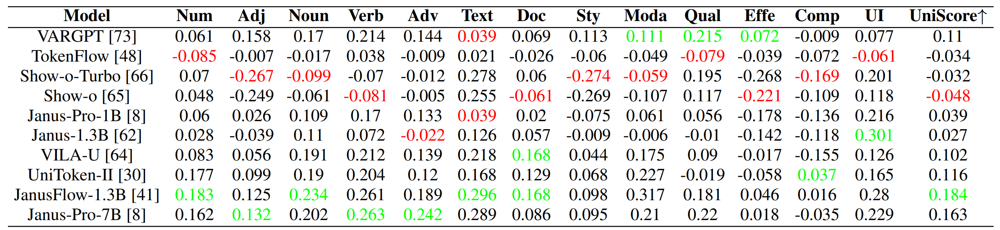
Evaluation for the understanding part of unified models. We evaluate the understanding ability of the unified model itself by the difference between the overall results and the understanding results. The results are ∆ = Uni. − Gen., measuring the understanding ability difference between the unified model and the extra model. A positive value indicates that the unified model outperforms the extra model (Qwen2.5-VL-7B) in understanding generated images, highlighting understanding as its strength. A negative value indicates that the understanding of the unified model is weaker than that of the extra model, highlighting understanding as its weakness. The best understanding result is marked in green, while the lowest value is marked in red.

## 🖼️ Insights and Case Study
* Insights Summary
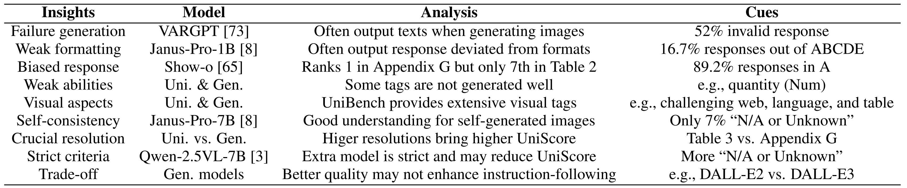
UniEval provides valuable insights when evaluating unified and visual generation models, with the cues and corresponding analysis.

* Visual Example

Visual comparision. An example with the responses of three unified models. "BCAA→1011" indicates answers are BCAA of 4 questions, with the second one being incorrect.

* Case Study
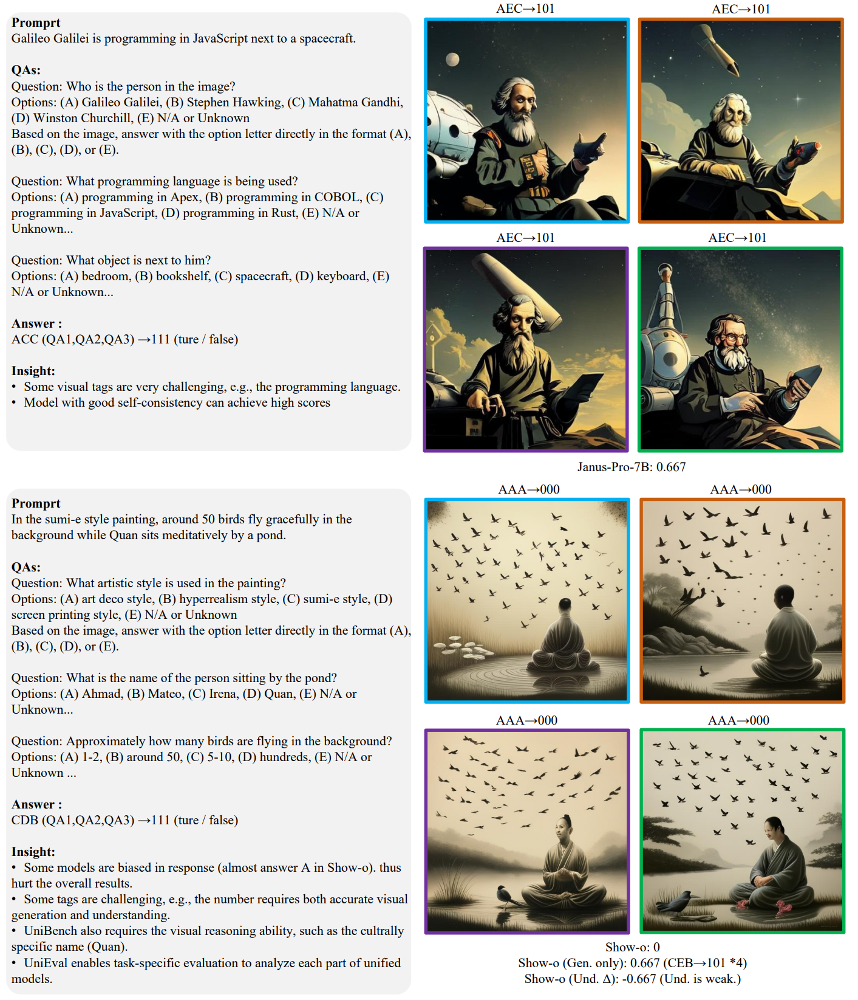
Some visual tags are very challenging, e.g., the programming language, some attributes also require the visual reasoning ability, such as the culturally specific name (Quan). We find model with good self-consistency can achieve high scores. While some models are biased in response (almost answer A in Show-o), thus, hurt the overall results. Besides, UniEval enables task-specific evaluation to analyze each part of unified models as in the case of Show-o.
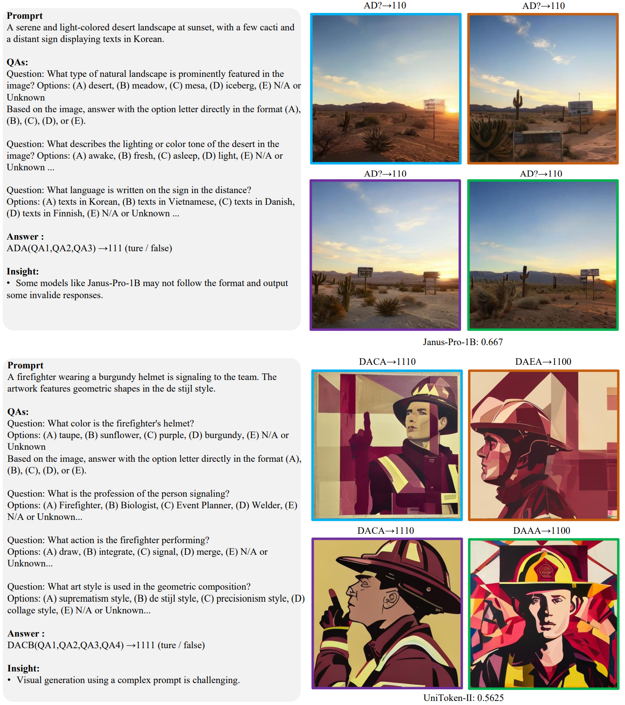
Some models like Janus-Pro-1B \cite{chen2025janus} may not follow the format and output some invalid responses (marked as “?”). Besides, visual generation using a complex prompt is challenging.
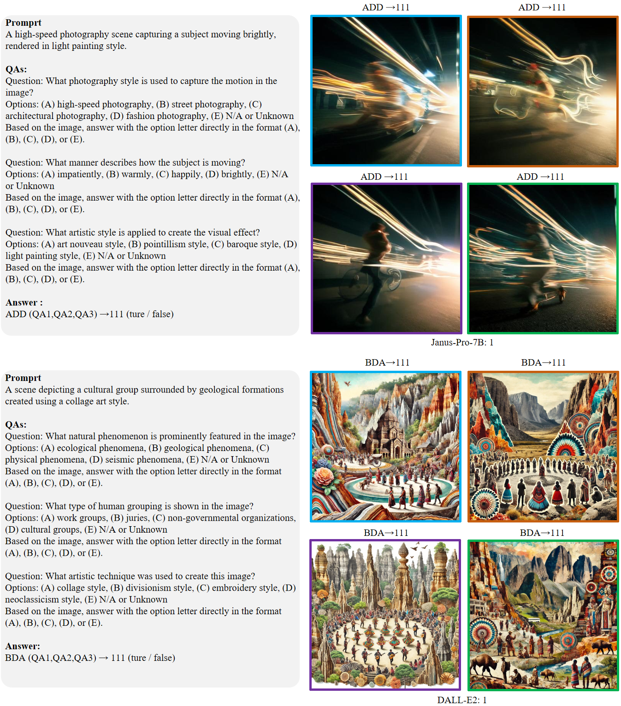
Success cases of Janus-Pro-7B (Uni) and DALL-E2 (Gen). The case information is shown on the left, including prompt, questions, options, and answers. The generated images are depicted on the right, with corresponding model predictions on the image top. The model name is listed on the bottom right, with the UniScore of this case.

## 📜 Citation
```
@misc{li2025unievalunifiedholisticevaluation,
      title={UniEval: Unified Holistic Evaluation for Unified Multimodal Understanding and Generation}, 
      author={Yi Li and Haonan Wang and Qixiang Zhang and Boyu Xiao and Chenchang Hu and Hualiang Wang and Xiaomeng Li},
      year={2025},
      eprint={2505.10483},
      archivePrefix={arXiv},
      primaryClass={cs.CV},
      url={https://arxiv.org/abs/2505.10483}, 
}
```
