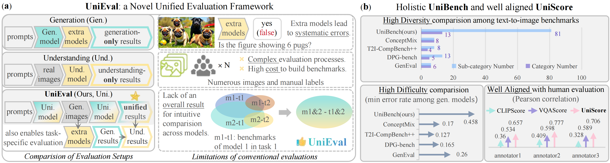

# UniEval: Unified Holistic Evaluation for Unified Multimodal Understanding and Generation
UniEval is the first evaluation framework designed for unified multimodal models, including a holistic benchmark UniBench and the UniScore metric.

[🐙 GitHub Page](https://github.com/xmed-lab/UniEval) [🤗 UniBench](https://huggingface.co/datasets/yili7eli/UniBench) [📄 arXiv](https://arxiv.org/abs/2505.10483)

## 💡 Introduction
The emergence of unified multimodal understanding and generation models is rapidly attracting attention due to their ability to enhance instruction-following capabilities while minimizing model redundancy. However, there is a notable lack of a unified evaluation framework for these models, which would enable a streamlined and comprehensive evaluation process. Current evaluation methods rely on multiple task-specific benchmarks, leading to significant limitations, such as: lack of overall results; errors from extra evaluation models; reliance on extensive labeled images; lack of diversity and difficulty; inadequate metrics to evaluate instruction-following. To address these challenges, we introduce UniEval, the first evaluation framework designed specifically for unified multimodal models without the need for extra models, images, or annotations. This framework facilitates a simplified and overall evaluation process. Experimental results demonstrate that UniBench presents a greater challenge than current benchmarks, and UniScore offers enhanced evaluation accuracy. We conducted extensive evaluations on SoTA unified and generative models, uncovering new insights into the unique advantages of UniEval. The key components of this code include:
* UniEval: An overall framework to evaluate unified models without extra models and labeled images.
* UniBench: A holistic benchmark that supports both unified and visual generation models, featuring 81 fine-grained tags to ensure high diversity.
* UniScore: A metric that aligns closely with human evaluations beyond existing metrics.


Overview of UniEval. (a). The proposed UniEval unifies the evaluation of both the multimodal understanding and generation, eliminating limitations due to extra models, labeled images, and the lack of overall results. (b). The proposed UniBench is a holistic and challenging benchmark, with the UniScore metric aligning well with humans.


Workflow of UniEval. An example in UniBench processed by Janus-Pro-7B generates four images and outputs choices for each image and question. UniScores involves case-level accuracy in a case and tag-level accuracy from answers in the same tag. Our method is versatile, supporting generation evaluation with an extra model, and understanding via the difference between unified and generation results.


## 🛠️ Simple to Use
### Installation
UniEval itself only has one dependency, tqdm, while the baseline models have different dependencies and environments. Please refer to models/install.txt to set up the corresponding environments for these models. If you want to run existing baselines please run:
```
pip install -r models/requirements.txt
```
The env can meet the needs of most models; for models requiring specific version dependencies, we wrote notes in models/install.txt.

### Benchmarking Implemented Models
* Basic command.
```
# python uni_eval.py [MODEL_NAME] [PATH_TO_RECORDS]
python uni_eval.py deepseek-ai/Janus-1.3B --save_path records/deepseek-ai/JanusFlow-1.3B
```

* Set specific GPU
```
# python uni_eval.py [MODEL_NAME] --gpus [GPU_ID] --save_path [PATH_TO_RECORDS]
python uni_eval.py deepseek-ai/JanusFlow-1.3B --gpus 0 --save_path records/deepseek-ai/JanusFlow-1.3B
```

* Batch processing to speed up.
```
# --gpus [GPU_IDS], 0_1_2_3 indicates four workers on GPU 0 1 2 3, split by _
python uni_eval.py deepseek-ai/Janus-Pro-7B --gpus 0_1_2_3 --save_path records/deepseek-ai/Janus-Pro-7B
```

* Batch processing and multi-GPUs for visual generation models.
```
# --gpus [GPU_IDS], worker1 uses GPUs 0,1, worker2 uses GPUs 2,3. worker split by _, multi-GPU use ,
# --extra_model [EXTRA UND. MODEL], apply Qwen2.5-VL-7B to evaluate PixArt-α.
python uni_eval.py PixArt-alpha/PixArt-XL-2-512x512 --gpus 0,1_2,3 --save_path records/PixArt-alpha/PixArt-XL-2-512x512 --extra_model Qwen/Qwen2.5-VL-7B-Instruct
```
Note that different devices, CUDA, and dependencies may lead to slightly different results.

* Implemented models are listed below. Please see models/install.txt to check their packages and model weights. If errors occur.
```
deepseek-ai/Janus-Pro-7B
deepseek-ai/Janus-Pro-1B
deepseek-ai/Janus-1.3B
deepseek-ai/JanusFlow-1.3B
OceanJay/UniToken-AnyRes-StageII
Show_o_Turbo
Show_o
VARGPT-family/VARGPT_LLaVA-v1
models/vila_u/vila-u-7b-256
TokenFlow
PixArt-alpha/PixArt-XL-2-512x512
sd-legacy/stable-diffusion-v1-5
stabilityai/stable-diffusion-2-1
stabilityai/stable-diffusion-xl-base-0.9
stabilityai/stable-diffusion-3-medium-diffusers
stabilityai/stable-diffusion-3.5-medium
dall-e-2
dall-e-3
black-forest-labs/FLUX.1-schnell
black-forest-labs/FLUX.1-dev
```

### Use Our Script to Evaluate Custom Models
* Step1: Copy uni_eval.py and uni_bench.json to your code
* Step2: Initialize your model and define required functions. Unified models need "generate" and "understand" callback functions. Gen-only models require the "generate" only. Please see "models/Janus/uni_gen_und.py" for the example of unified models, and "models/PixArt/gen.py" for Gen-only models.
```
# Gen. Input: [TEXT] [OUT_IMG_NUM] [IMG_SAVE_PATH]. Output: [LIST_OF_GENERATED_IMAGE_PATHS]
generate(text, num, temp_save_path)
# Und. Input: [IMG_PATH] [QUESTION_PROMPT]. Output: [OUTPUT_TEXT]
understand(img, prompt)
```
Note that understand() is only defined by Uni. models. Gen-only models just need to copy models/Qwen2.5-VL/und.py to your code get the understand function as below:
```
from und import QWenVL
model = QWenVL(model_name)
understand = model.understand
```
* Step3: Run the uni_eval() function to eval both Uni. models and Gen-only models.
```
# Input: [GEN_FUNC] [UND_FUC] [UNI_BENCH] [RECORD_SAVE_PATH] [GEN_IMG_PER_CASE]. Ouput: printed results and records
from uni_eval import uni_eval, seed_everything
seed_everything(1024)
uni_bench = json.load(open('uni_bench.json'))
uni_eval(generate, understand, uni_bench, save_path='records/custom_model', img_num=4)
```
You can also import your model as load_model() of uni_eval.py, and use commands in "Benchmarking Implemented Models" for batch test.


## Documentation
[📚 Doc](DOC.md) Include leaderboard, comparision, detailed results, human study, and case study, etc.

## LICENSE
This project is licensed under the MIT License.

## Citation
```
@misc{li2025unievalunifiedholisticevaluation,
      title={UniEval: Unified Holistic Evaluation for Unified Multimodal Understanding and Generation}, 
      author={Yi Li and Haonan Wang and Qixiang Zhang and Boyu Xiao and Chenchang Hu and Hualiang Wang and Xiaomeng Li},
      year={2025},
      eprint={2505.10483},
      archivePrefix={arXiv},
      primaryClass={cs.CV},
      url={https://arxiv.org/abs/2505.10483}, 
}
```
